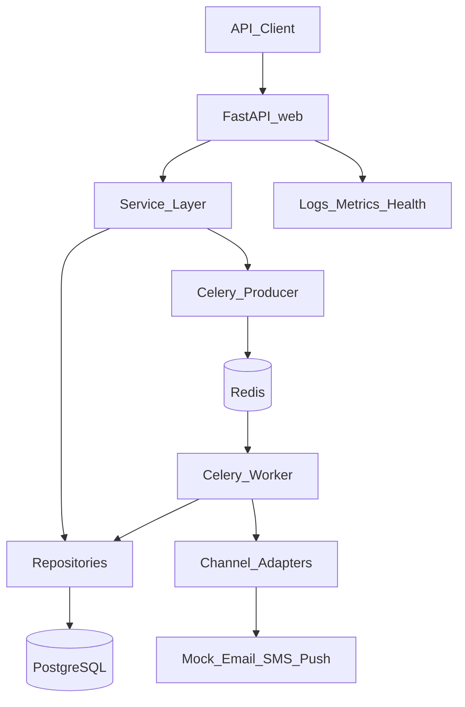
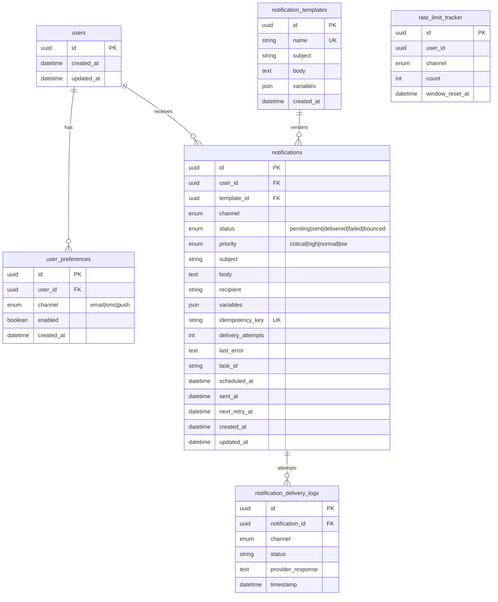
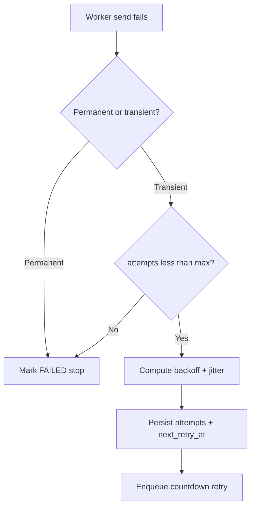
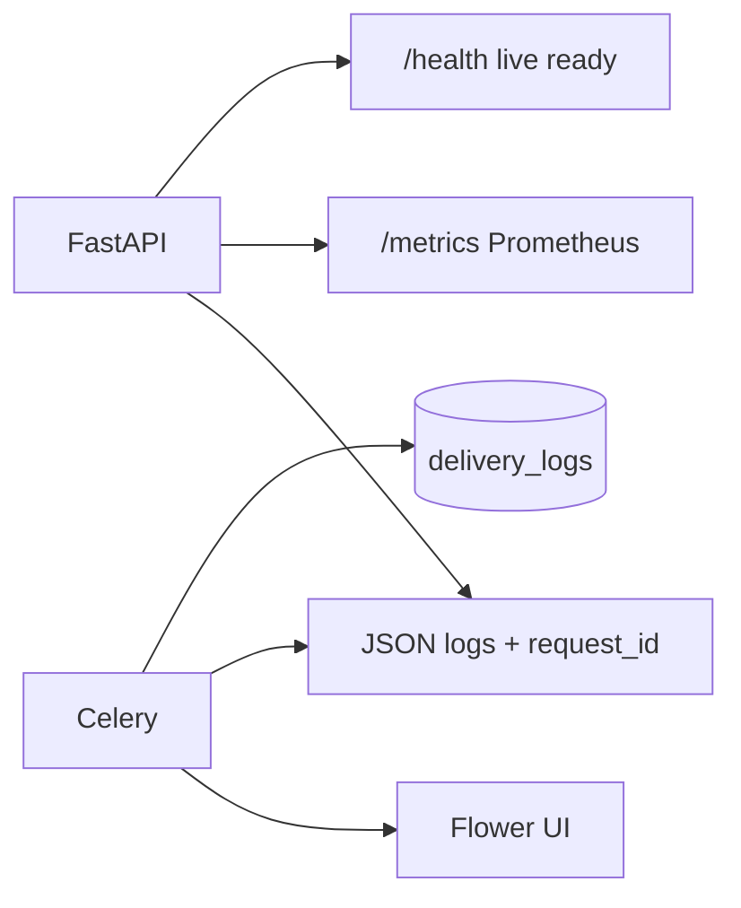
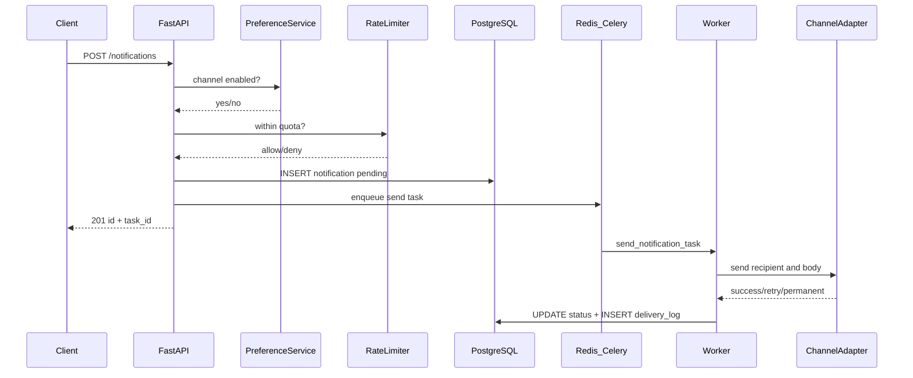
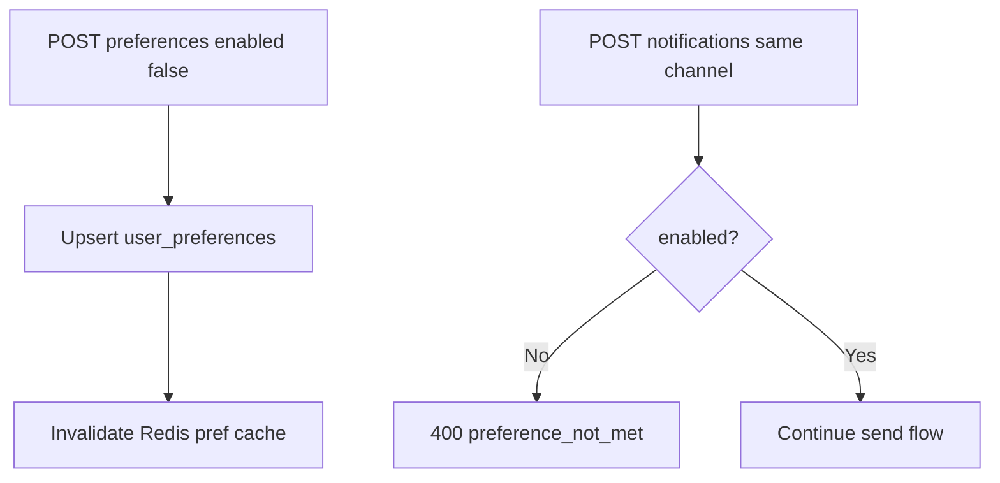

# Design Document — Notification Service

Engineering architecture, design standards, schema, and data flows.
For setup, API examples, and assumptions, see [README.md](README.md).

## High-level architecture

```
Client -> FastAPI (validation, preferences, rate limit, persist)
       -> Celery producer (Redis broker)
       -> Celery worker -> Channel adapter (Email/SMS/Push mock)
       -> Update status + delivery_logs in PostgreSQL
```

Layers:

1. **API** — routers, middleware, DI
2. **Services** — notification, preference, rate limit, retry
3. **Domain** — entities, enums, exceptions, protocols (no infra imports)
4. **Repositories / adapters** — SQLAlchemy + channel adapters
5. **Infrastructure** — Redis, Celery, circuit breaker, mock providers



**Runtime services (Docker Compose):**

| Service | Role |
|---------|------|
| `web` | FastAPI API — only entry for clients |
| `postgres` | Source of truth for notifications, prefs, templates, logs |
| `redis` | Celery broker/result backend, preference cache, rate limits |
| `celery_worker` | Async delivery + retries |
| `celery_flower` | Task monitoring UI |

**Key constraint:** HTTP handlers do **not** call providers synchronously. They persist a `pending` notification and enqueue work so the API stays fast under load.

## Database schema

- `users` — external user ids only
- `user_preferences` — per-channel opt-in/out (unique user_id+channel)
- `notification_templates` — reusable `{{var}}` templates
- `notifications` — lifecycle, priority, idempotency_key (unique), attempts, errors
- `notification_delivery_logs` — audit trail per attempt
- `rate_limit_tracker` — optional DB tracker (primary limiter is Redis)

Indexes focus on `(user_id, status, priority, created_at)` and unique idempotency keys for high read/write throughput.

### Entity-relationship diagram



### Relationships & indexes

| Relationship | On delete |
|--------------|-----------|
| `users` → preferences / notifications | CASCADE |
| `templates` → notifications | SET NULL |
| `notifications` → delivery_logs | CASCADE |

| Index / constraint | Why |
|--------------------|-----|
| `(user_id, status, priority, created_at)` | History + filtering |
| Unique `idempotency_key` | Deduplicate retries/client repeats |
| `(notification_id, timestamp)` on logs | Attempt timeline |
| Unique `(user_id, channel)` on preferences | One row per channel |

## Failure handling and retries

- Classify permanent (`invalid_email`, `invalid_number`, …) vs transient (`timeout`, `service_down`, …).
- Max 3 retries with exponential backoff (~2, 4, 8 minutes) plus jitter.
- Persist attempt state before scheduling the next retry (no silent loss).
- Per-channel circuit breaker: open after consecutive failures; half-open probe after recovery window.



## Scalability (1000+/sec)

- API path is enqueue-only (persist + Redis publish) for low latency.
- Horizontal Celery workers process deliveries asynchronously.
- Redis for rate limits and preference cache; PostgreSQL connection pooling.
- Priority mapped onto Celery task priority so critical work is preferred.

| Decision | Benefit |
|----------|---------|
| Enqueue-only API | Low latency; supports high request rate |
| Horizontal Celery workers | Scale delivery independently of API |
| Celery task priority | Critical/high processed before low |
| Redis preference + rate-limit cache | Sub-ms checks on hot path |
| Channel adapters + factory | Add providers without rewriting core services |
| Composite indexes on notifications | Fast history/filter queries |

**Target shape for ~1000+/sec intake:** many API replicas + Redis + worker pool; DB sized for write amplification of status updates and delivery logs.

## Trade-offs

| Decision | Trade-off |
|----------|-----------|
| Sync SQLAlchemy + Celery workers | Simpler than fully async ORM; FastAPI stays responsive via async enqueue |
| Mock providers | Focuses on service design, not vendor SDKs |
| Fail-open rate limit if Redis down | Availability over strict limiting in degraded mode |
| Default opt-in preferences | Safer for transactional alerts; document for product review |

### Architecture decisions (detail)

#### Async queue (Celery + Redis) vs sync send in the request
**Choice:** Persist + enqueue; worker delivers.  
**Rationale:** Assignment requires high throughput and reliability; sync provider calls would block and lose work on timeouts.  
**Trade-off:** Eventual consistency for `delivered` status; clients poll `GET /notifications/:id`.

#### Mock providers vs real SMTP/Twilio/FCM
**Choice:** Configurable mock providers.  
**Rationale:** Spec asks for service design, not vendor integration.  
**Trade-off:** No real delivery; adapters are the swap point for production providers.

#### Sync SQLAlchemy in workers + FastAPI
**Choice:** Sync ORM sessions in repositories/workers.  
**Rationale:** Simpler Celery integration; API still returns quickly after enqueue.  
**Trade-off:** Not a fully async end-to-end stack.

#### Rate limit fail-open if Redis is down
**Choice:** Allow traffic when limiter storage is unavailable.  
**Rationale:** Prefer availability for transactional alerts in demo/degraded mode.  
**Trade-off:** Temporary oversend until Redis recovers.

#### Default channel opt-in
**Choice:** Missing preference = enabled.  
**Rationale:** Safer default for order/shipping style alerts.  
**Trade-off:** Product may prefer default opt-out for marketing — documented as an assumption in README.

## Observability

- JSON logs with request_id and PII masking
- Prometheus metrics at `/metrics`
- `/health`, `/health/live`, `/health/ready`
- Flower UI for Celery when running Compose



| Layer | Signal |
|-------|--------|
| Structured JSON logs | method, path, status, duration, `request_id`; PII masked |
| Prometheus `/metrics` | send/fail counters, histograms |
| Flower | Celery task visibility |
| Delivery logs table | Per-attempt provider outcome |

---

## Design Principles

| Principle | Where it appears |
|-----------|------------------|
| **Single Responsibility** | `PreferenceService` only prefs; `RateLimiter` only quotas; `RetryService` only backoff/classification; adapters only send |
| **Open / Closed** | New channel = new adapter + factory registration; `NotificationService` / routers unchanged |
| **Liskov Substitution** | `EmailAdapter`, `SMSAdapter`, `PushAdapter` are interchangeable behind `AbstractChannelAdapter` / `IChannelAdapter` |
| **Interface Segregation** | Domain `Protocol`s (`NotificationRepository`, `PreferenceRepository`, channel adapter) expose only needed methods |
| **Dependency Inversion** | Services depend on repository protocols and factories; FastAPI `Depends` wires SQLAlchemy + Redis at the edge |
| **Separation of Concerns** | Routers parse/respond → services orchestrate → repositories query → adapters talk to providers |
| **Fail Fast** | Pydantic validates requests; recipient format validated before enqueue |
| **Graceful Degradation** | Rate limiter / preference cache fail-open if Redis is down so API stays available |

## Design Patterns

| Pattern | Location | Purpose |
|---------|----------|---------|
| **Repository** | `src/repositories/` + `src/domain/repositories.py` | DB access behind protocols; services never import ORM models for business rules |
| **Adapter** | `src/channels/*_adapter.py` | Wrap mock providers behind a common send/validate interface |
| **Factory** | `src/channels/factory.py` | Resolve adapter by `Channel` |
| **Strategy** | Channel + priority routing | Delivery behavior selected by channel/priority without branching in the API layer |
| **Circuit Breaker** | `src/infrastructure/circuit_breaker.py` | Per-channel isolation when providers fail repeatedly |
| **Producer / Consumer** | `src/queue/producer.py`, `src/queue/tasks.py` | Decouple accept-from-deliver |
| **DTO / Schema** | `src/domain/schemas.py` | Pydantic request/response contracts + OpenAPI |
| **Constructor / DI** | `src/api/v1/dependencies.py` | Manual injection via FastAPI `Depends` |

## Branching Strategy

Git Flow–inspired; one branch per deliverable:

```
main
  └─ develop
       ├─ feature/project-setup
       ├─ feature/database-schema
       ├─ feature/core-domain
       ├─ feature/queue-processing
       ├─ feature/notification-channels
       ├─ feature/preferences-management
       ├─ feature/api-endpoints
       ├─ feature/retry-mechanism
       ├─ feature/monitoring-observability
       ├─ feature/testing-suite
       ├─ feature/docker-deployment
       ├─ feature/documentation
       └─ fix/runtime-issues
```

**Merge policy:**
1. Feature/fix PRs target `develop`
2. Release: PR `develop` → `main`
3. Tag `v1.0.0` on `main` for submission

## Database Migration Strategy

Schema is managed with **Alembic** (SQLAlchemy).

| Command | When |
|---------|------|
| `alembic revision --autogenerate -m "..."` | Local — new migration |
| `alembic upgrade head` | Local / container startup — apply pending |
| `init_db()` fallback | Demo bootstrap if migrate fails |

**Initial migration (`001_initial`):**  
`users`, `user_preferences`, `notification_templates`, `notifications`, `notification_delivery_logs`, `rate_limit_tracker`, enums, indexes, FKs.

**Production safety:**
- Compose `entrypoint.sh` waits for Postgres, then runs `alembic upgrade head`
- Enums persist **values** (`email`) not names (`EMAIL`) via SQLAlchemy `values_callable`
- Idempotency key is unique at the DB layer

## Deployment & Release Strategy

**Local / demo platform:** Docker Compose (multi-service).

**Containers:**

```
postgres · redis · web · celery_worker · celery_flower
```

**Docker build:** multi-stage (`builder` installs deps → `runtime` slim image, non-root `appuser`).

**Release flow:**

```
feature/* → PR → develop → PR → main → tag v1.0.0
```

**Health:**
- `GET /health`, `/health/live`, `/health/ready`
- Compose healthchecks on Postgres/Redis; web HEALTHCHECK curls `/health`

**Rollback:** redeploy previous image/tag; schema rollback = new corrective Alembic migration.

## Development Standards

### Error handling

Domain errors extend a shared base and map to HTTP via global handlers:

| Exception | Typical HTTP |
|-----------|----------------|
| `InvalidNotificationException` / preference violations | 400 |
| `NotificationNotFoundException` / `TemplateNotFoundException` | 404 |
| `IdempotencyConflictException` | 409 |
| `RateLimitExceededException` | 429 |
| `ChannelNotAvailableException` / `CircuitOpenException` | 503 |
| Unhandled | 500 (`internal_error`) |

Response envelope:

```json
{
  "error": "rate_limit_exceeded",
  "message": "...",
  "details": {},
  "request_id": "...",
  "timestamp": "..."
}
```

### Testing approach

| Layer | Focus |
|-------|--------|
| Unit | Domain, retry/backoff, rate limiter, adapters, circuit breaker |
| Integration | API notifications/preferences against in-memory/test DB + fake Redis; eager Celery in tests |

## Data Flows

### Send notification



### Preference opt-out



## Known Limitations

- Providers are mocks — no real email/SMS/push egress
- Auth not implemented (assumed at gateway)
- Rate limit fails open if Redis is unavailable
- No webhook callbacks for delivery status (optional bonus not required)
- Priority is Celery task priority / routing — not a full multi-queue fair scheduler
- Windows hosts must keep shell scripts LF for Docker entrypoints
